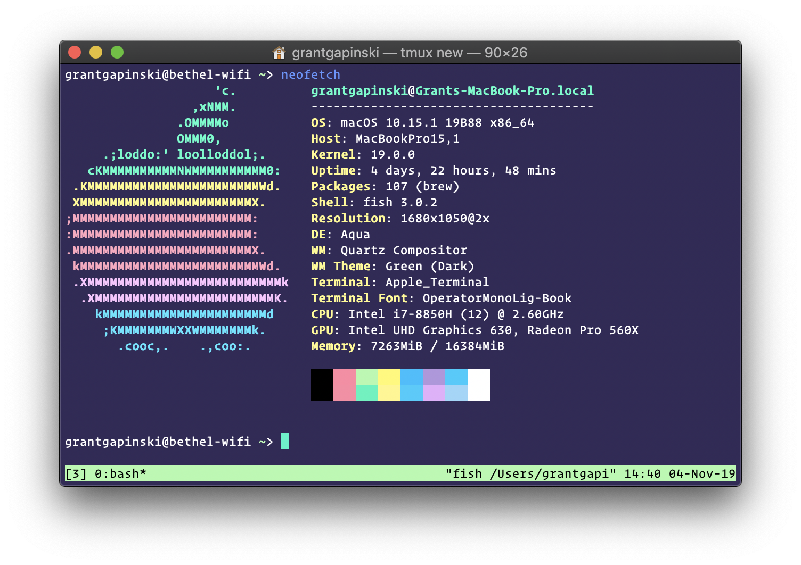

# cyberpunk-terminal

> cyberpunk colorscheme for Terminal

> This is a port of Murderlon's cyberpunk-iterm branch, which I roughly ported to MacOS

## References
- VS Code CyberPunk Theme --> [cyberpunk](https://github.com/prometheux-ar/cyberpunk)
- iTerm Theme --> [cyberpunk-iterm](https://github.com/Murderlon/cyberpunk-iterm)
